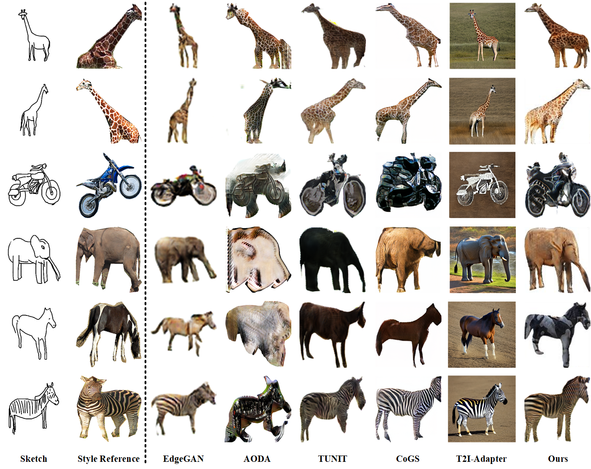

# SMFS-GAN


## Preparation

###  1. Clone the repository

```bash
$ git clone https://github.com/CrazyDavee/smfs-gan-master.git
$ cd smfs-gan-master
```

### 2. Prepare Datasets

1. Download [SketchyCOCO Object Dataset](https://github.com/sysu-imsl/SketchyCOCO) and [Qmul-sketch Dataset](https://drive.google.com/file/d/18jWDOUr5zfFQphLzAxeWx0H50GigZ7l3/view).
2. Download our expanded dataset [Qmul-sketch+](https://drive.google.com/file/d/1VkGZcDwHX-xIF4IFNsOAHHBzPEuGJq0Z/view?usp=sharing), and combine it with Qmul-Sketch.

3. The structure of the folder is as follows:

   ```
   data
   	--qmul
   		--train
   			--sketch
   				--class1
   					1.png
   					2.png
   					...
   				--class2
   					1.png
   					2.png
   					...
   				...
   			--image
   				--class1
   					...
   				--class2
   					...
   		--test
   			...
   	--sketchyCOCO
   		...
   ```

## 3. Prepare environments

python = 3.7

torch = 1.7  torchvision=0.8.0

tensorboardX

tqdm

Pillow


## 4. Train model

```
python main.py --gpu 0 --data_path your/data/path --w_vec 0.1 --w_edge_loss 10 --w_sty_recon 1.0 --with_tom --with_attn --w_sty 1.0 --batch_size 1 --dataset qmul-sketch  --vgg_version vgg11
```

## 5. Test model


```
python main.py --gpu 0 --validation --load_model your_model_name --data_path your/data/path --dataset qmul-sketch+ --with_attn --load_epoch 40 --vgg_version vgg11
```


## 6. Results

Qmul-Sketch+


SketchyCOCO Object



Pseudosketches


## Contact

If you encounter any problems, please contact us.

